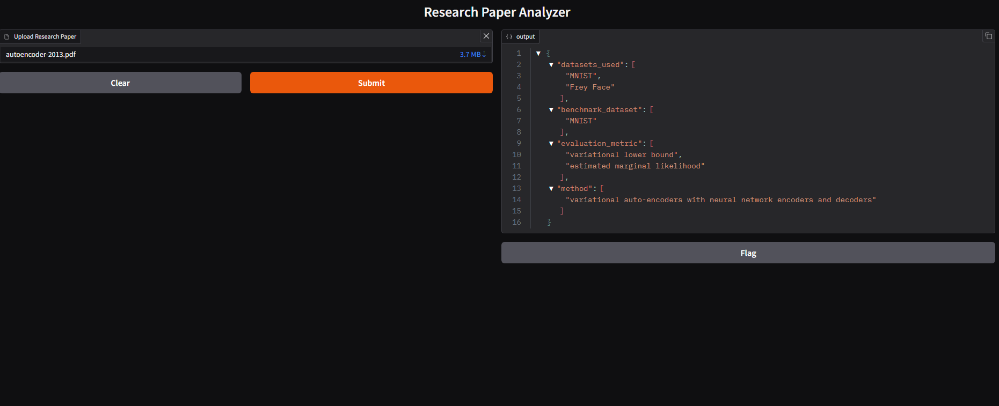

# Multi-Query RAG System for Research Paper Information Extraction

## Overview

This project implements a Retrieval-Augmented Generation (RAG) pipeline to extract structured information from research papers (PDF format). The system processes the document and generates a JSON output containing key fields such as datasets used, evaluation metrics, and methods.

The design focuses on multi-query retrieval, query-level context isolation, and reranking to improve extraction accuracy.

---



---

## Working

1. User uploads a research paper through the Gradio interface
2. PDF text is extracted using Unstructured
3. Extracted text is split into chunks using RecursiveCharacterTextSplitter
4. Chunks are embedded and stored in ChromaDB
5. Multiple predefined queries are executed (one per target field)
6. For each query:

   * Top-K relevant chunks are retrieved
   * Retrieved chunks are stored separately to maintain query-level isolation
7. Retrieved chunks are passed through a reranker
8. Reranking is performed independently for each query, and the reduced set of chunks is maintained separately per query
9. Reranked context is sent to a local LLM (Qwen2.5:7B via Ollama)
10. Final structured JSON output is generated

---

## Data Flow

PDF Input
→ Text Extraction
→ Chunking
→ Embedding + Storage (ChromaDB)
→ Multi-Query Retrieval (Top-K per query)
→ Query-wise Context Separation
→ Query-wise Reranking (independent per query)
→ LLM Inference (Ollama)
→ JSON Output

---

## Project Structure

```id="q1z9vk"
genai-project/
│
├── app/
│   ├── api/
│   │   └── routes.py
│   │
│   ├── core/
│   │   ├── embeddings.py
│   │   └── vectordb.py
│   │
│   ├── models/
│   │   └── schema.py
│   │
│   ├── services/
│   │   ├── extractor.py
│   │   ├── pipeline.py
│   │   ├── reranker.py
│   │   └── retrieval.py
│   │
│   ├── utils/
│   │   ├── chunking.py
│   │   ├── logger.py
│   │   └── pdf_loader.py
│   │
│   └── main.py
│
├── data/
│   ├── chroma_db/
│   ├── log/
│   └── papers/
│
├── frontend/
│   └── gradio_ui.py
│
├── .gitignore
├── .python-version
├── README.md
├── requirements.txt
├── uv.lock
├── pyproject.toml
│
├── testing_1.ipynb
└── testing.ipynb
```

---

## Key Components

* Retrieval: Vector similarity search using ChromaDB
* Chunking: RecursiveCharacterTextSplitter
* Reranking: Query-wise reranking with independent context handling
* LLM: Qwen2.5:7B via Ollama (local inference)
* Interface: Gradio

---

## Output

The system generates structured JSON output. Example:

```id="k3x8bn"
{
  "datasets_used": [...],
  "evaluation_metrics": [...],
  "methods": [...]
}
```

---

## Notes

* Each query is processed independently to avoid context mixing
* Reranking is applied per query and preserves query-specific context
* Designed for extensibility (additional queries or fields can be added easily)
